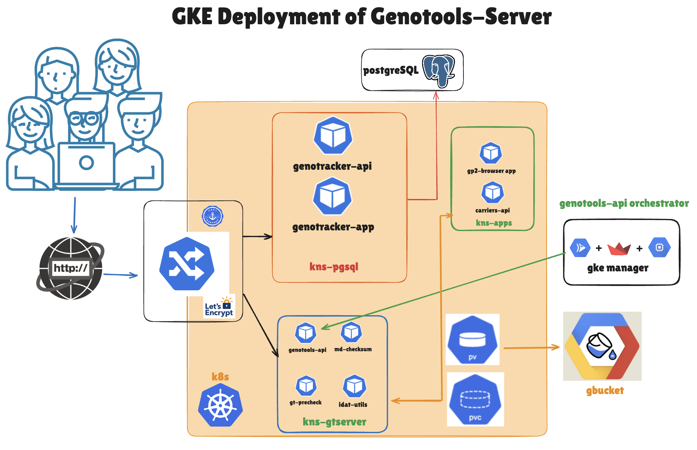

# Genotools-Server
+ Please note that this project is still under development and more apps and features are coming soon.
## Design
+ Please note that current implementation is based on single namespace and single cluster with one nodepool for gp2-browser and genotracker apps and genotracker api, one nodepool for genotools-api and gtprecheck api.

## Overview
GenoTools-Server is a set of apps and services to facilitate various genetics processing pipeline and visualization apps.
## apps
+ gp2-browser app
+ genotracker app
+ gke-manager app
+ More coming
## microservices
+ genotools api
+ gtprecheck api
+ genotracker api
+ More coming
## Management apps
+ gke-manager
+ Workflow Manager - Stay Tuned
## Airflow
+ Work in progress
## Deployment
Deployment folder contains deployment scripts (for cluster, microservices and apps) organized in gke-setup and helm-charts folder. All cluster resources are deployed using bash scripts. All genotools-servermicroservices and app are deployed using helm charts. Following third party helm charts are used.
1. External Secret Operator: to serve all secrets used in the postgresql, microservice and apps from GCP Secrte Manager
2. Cert-Manager: For SSL/TLS certificates via Let's encrypt for secure traffic.
### gke-setup
Please Remember to change GCP Project ID, VM Machine Type and Permissions, etc. in gke-cluster.sh.
If deploying few apps, then please deploy relevant nodepools from nodepools folder.

Requirements: gcloud sdk, kubectl and helm

Cluster and nodepool setup and teardown scripts are located in this folder and should be run from terminal as described below.
#### cluster
  + This folder contains scripts to setup/teardown a gke cluster and setup necessary gcp and k8s service acoount, persistent volums (PV) and persistent volume claims (PVC) for gke cluster apps and microservices.
    + Cluster Setup (and teardown): Please run from terminal: bash cluster-setup.sh (bash cluster-teardown.sh)
#### nodepools
  + This folder contains scripts to setup/teardown necessary nodepools for gke cluster apps and microservices.
    + Nodepool Setup (and teardown): Please run from terminal: bash nodepools-setup.sh (bash nodepools-teardown.sh)
### helm-charts
Please note that deployment is a two step process (due to cert-manager restriction on signing certificates). In the first step, Please comment out Line cluster 10 and 12-19 in the cluster-ingress.yaml and deploy the helm chart (only dev/staging/prod) as described below. Please waith for ~10 minutes for all apps to come online. You can use either curl or browser (using http protocol) to check if apps are online. Then uncomment Line cluster 10 and 12-19 in the cluster-ingress.yaml and deploy the helm chart (only dev/staging/prod) as described below. Please note that it might take more than 10 minutes for all apps to come online. Now you can use either curl or browser (using https protocol) to check if apps are online..

This folder contains helm charts for genotools-server related microservices and apps (test, dev and prod) including manifest files for third party helm charts (packages). 
#### packages
This folder contains third party helm charts including cert-manager and external secret operator.
+ From helm-charts folder run: bash dep-packages.sh. Alternatively, you can run each of the following scripts individually.
  + From inside this folder, please run following command:
    + bash secret-operator.sh
    + bash cert-manager.sh

#### dev/staging/prod
Each of these folders contains helm charts for all microservices, apps, ingress etc. For example, for dev, please run following command (from one directory above dev folder):
+ helm install genotools-server dev/ 
+ __IMPORTANT:__ As genotools-server serves https traffic, we need to initially deploy cluster with http ingress from dev/ folder as above. After http traffic is running for all apps, we can enable https traffic. __In order to enable https traffic, we need to upgrade helm deployment (from the last step) with helm upgrade staging/ -n default (this will enable https traffic with staging certificates from let's encrypt)__. 
  + check any of the web url's: curl -v --insecure https://gt-precheck.genotools-server.com
+ __Next:__ Once https traffic is available, we need to use production clusterIssuer. For this please upgrade helm deployment (from the last step) with helm: helm upgrade prod/ -n default (this will enable https traffic with prod certificates from let's encrypt).

# CI/CD 
+ Currently docker images for all apps and microservice are manully deployed to GCP artifac registry. 
+ CI/CD pipeline is under implementation now and will be available soon.
  + CI: github action based pipeline
  + CD: Argo CD based pipeline